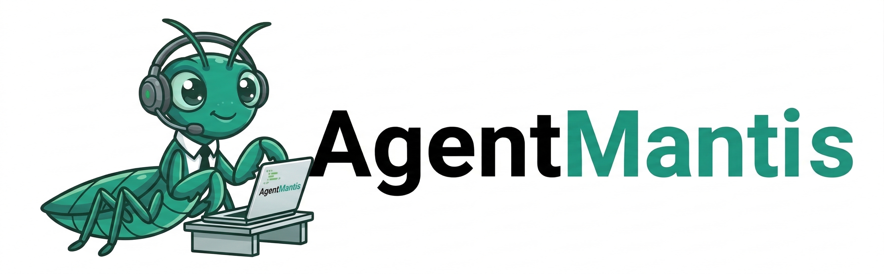
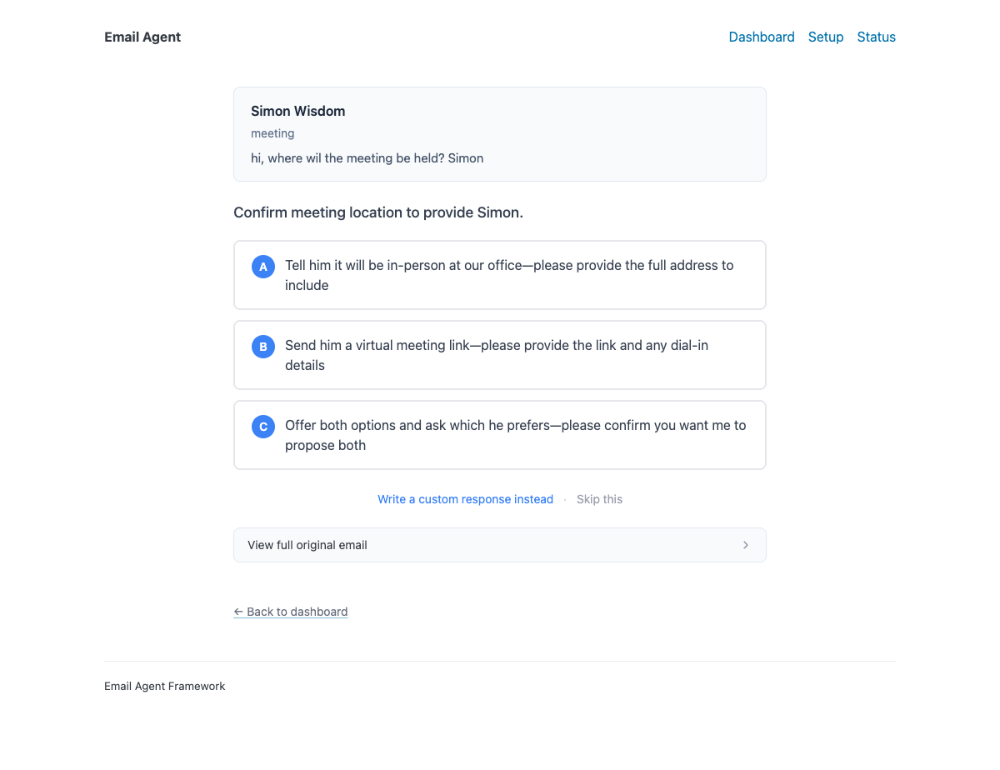

# AgentMantis — Email Agent Framework by Nesta

A customisable email agent built with [LangGraph](https://github.com/langchain-ai/langgraph) that automates triage, response drafting, and human-in-the-loop review.

## Features

- **Email Triage**: Automatically classifies emails as `respond`, `notify`, or `ignore`
- **Response Drafting**: Uses LLMs to draft contextual email responses
- **Safe by default**: The agent never sends emails without human approval. All drafts are paused for review via the web UI, CLI, or LangGraph Studio. Auto-send requires explicitly enabling `WORKER_AUTO_ACCEPT_INTERRUPTS=true` (testing only)
- **Web UI**: Built-in dashboard for reviewing and approving email drafts
- **Memory System**: Learns user preferences over time
- **Gmail Integration**: Full Gmail API support for reading and sending emails
- **RAG Support**: Optional knowledge base search for informed responses
- **PDF Processing**: Extracts and summarizes PDF attachments


## Background

### The problem

Across many organisations, administrative bottlenecks and repetitive email-based processes consume significant time. Nesta's sustainable future team identified that heat pump installers face this acutely — the DNO (distribution network operator) application process causes delays of 3–11 days, mostly waiting for trivial forms or confirmation emails, and many applications are rejected on first submission.

### What we built

Originally developed with [Renbee](https://www.renbee.com/), a startup tackling home decarbonisation, the first implementation was a DNO communications manager — an email agent that monitors responses, collects information, interprets requests, and follows up on behalf of installers. This open-source repo is the generalised version of that work, designed so others can adapt it for their own domain.

### Why agentic AI (not filters / RAG / Gmail AI)

- Unlike simple filters or auto-replies — handles complex multi-step workflows with human approval at each critical step
- Unlike pure RAG — doesn't just retrieve context; actively asks clarifying questions, learns preferences over time, and adapts. RAG is one optional component, but the core value is the agentic loop
- Unlike Gmail/Google's built-in AI — fully customisable to specific organisational needs, with domain-specific tools, knowledge bases, and triage rules

### Design choices

- **Azure OpenAI** — data residency and compliance requirements for the original deployment
- **FlagEmbedding/BAAI embedding model** — runs locally to avoid sending potential PII through external embedding APIs. Open-source with no API dependency

### Customisation for your domain

The framework is email-focused. The main extension points for adapting it to a new domain are:

- The **RAG knowledge base** (swap in your own documents/Qdrant collection)
- **PDF extraction** rules (customise what gets extracted from attachments)
- **Prompts** (`email_agent/agent/prompts.py`) for triage rules and response style

## Architecture

```
email_agent/
├── agent_api/           # FastAPI server + background worker
│   ├── server.py        # REST API endpoints
│   ├── web_routes.py    # Web UI routes
│   ├── worker.py        # LangGraph worker (polls Gmail, processes emails)
│   ├── storage.py       # PostgreSQL persistence
│   ├── schemas.py       # Pydantic models
│   └── templates/       # Jinja2 templates for web UI
│
├── agent/               # LangGraph email assistant
│   ├── graph.py         # Main workflow definition
│   ├── prompts.py       # LLM prompts and instructions
│   ├── schemas.py       # State and message types
│   ├── configuration.py # Mode configuration
│   ├── utils.py         # Parsing, formatting utilities
│   ├── eval/            # Evaluation framework
│   └── tools/           # LangGraph tools
│       ├── default/     # Basic email/calendar tools
│       ├── gmail/       # Gmail API integration
│       └── rag/         # Document retrieval
│
└── config/              # YAML configuration files
```

## Quick Start

### Prerequisites

- Python 3.11+
- PostgreSQL 16+
- Gmail OAuth credentials (for Gmail integration)

### Installation

```bash
# Clone the repository
git clone https://github.com/simonwisdom/nesta-email-agent-framework.git
cd nesta-email-agent-framework

# Install dependencies with uv
uv sync

# Install dev dependencies (linting, tests, pre-commit)
uv sync --group dev

# Copy and configure environment variables
cp .env.example .env
# Edit .env with your settings

# Install pre-commit hooks
uv run pre-commit install --install-hooks
```

### Running Locally

```bash
# Start Postgres (or use docker compose below)
# Example: docker run --name email-agent-postgres -p 5432:5432 -e POSTGRES_USER=email_user -e POSTGRES_PASSWORD=email_password -e POSTGRES_DB=email_agent -d postgres:16-alpine

# Start the API server
uv run uvicorn email_agent.agent_api.server:app --reload

# In another terminal, start the worker
uv run python -m email_agent.agent_api.worker
```

### Running with Docker

```bash
# Ensure .env exists at repo root
cp .env.example .env

cd docker
docker compose up -d
```

## Configuration

Copy `.env.example` to `.env` and configure your settings. Key variables:

- `DATABASE_URL` - PostgreSQL connection string
- `GMAIL_CLIENT_ID` / `GMAIL_CLIENT_SECRET` - OAuth credentials
- `AZURE_OPENAI_*` - Azure OpenAI endpoints and API key

## LangGraph Workflow

The email assistant follows this workflow:

1. **Triage**: Classify incoming email as `respond`, `notify`, or `ignore`
2. **Response Agent**: If `respond`, draft a response using available tools
3. **Human Review**: Interrupt for user approval before sending
4. **Memory Update**: Learn from user feedback to improve future responses

## Human-in-the-Loop (HITL) Review

When the agent drafts an email or needs user input, it pauses execution using LangGraph's `interrupt()` mechanism. You have several options for handling these interrupts:

### Option 1: Built-in Web UI (Recommended)

The framework includes a web interface for reviewing pending actions:

- **Dashboard** (`/`) - View all pending jobs with auto-refresh
- **Review Page** (`/jobs/{job_id}`) - Review email drafts, edit content, approve or reject
- **Setup Wizard** (`/setup`) - Configure Gmail OAuth credentials
- **Status Page** (`/status`) - Check system health and worker status

Simply start the server and navigate to `http://localhost:8000` in your browser.



### Option 2: CLI Review Tool

The framework includes a built-in CLI for reviewing pending actions:

```bash
# List all pending jobs awaiting review
uv run email-agent-review list

# Review a specific job interactively
uv run email-agent-review review hitl-abc123

# Watch mode - get notified of new jobs
uv run email-agent-review watch

# Quick actions (skip interactive review)
uv run email-agent-review accept hitl-abc123
uv run email-agent-review ignore hitl-abc123
```

The CLI requires these environment variables:

- `DATABASE_URL` - PostgreSQL connection string
- `AGENT_API_URL` - API URL (default: `http://localhost:8000`)
- `AGENT_API_KEY` - API key if authentication is enabled

### Option 3: LangGraph Studio

[LangGraph Studio](https://github.com/langchain-ai/langgraph-studio) provides a visual interface for managing agent workflows, including an "Agent Inbox" for handling interrupts.

1. Install LangGraph Studio following the [official documentation](https://langchain-ai.github.io/langgraph/concepts/langgraph_studio/)
2. Point it to your running LangGraph instance
3. Use the Agent Inbox to review and respond to pending actions

### Option 4: Auto-Accept Mode (Testing Only)

For development and testing, you can bypass human review entirely:

```bash
WORKER_AUTO_ACCEPT_INTERRUPTS=true
```

This automatically accepts all proposed actions without human review.

## Extending the Framework

### Adding Custom Tools

Create a new tool in `email_agent/agent/tools/`:

```python
from langchain_core.tools import tool

@tool
def my_custom_tool(arg: str) -> str:
    """Description of what your tool does."""
    return f"Result: {arg}"
```

Register it in `tools/base.py` and add to the appropriate mode in `configuration.py`.

### Customizing Prompts

Edit `email_agent/prompts.py` to customize:

- Triage rules (`default_triage_instructions`)
- Response style (`default_response_preferences`)
- System prompts (`agent_system_prompt_hitl_memory`)

## Development

```bash
# Format code
uv run ruff format .

# Lint
uv run ruff check . --fix

# Run pre-commit on all files
uv run pre-commit run --all-files

# Run tests
uv run pytest
```

## License

MIT License - see [LICENSE](LICENSE) for details.

## Contributing

Contributions are welcome! Please submit pull requests to the `main` branch.

## Acknowledgments

This framework was developed by [Nesta](https://www.nesta.org.uk/) as part of the Agentic AI Residency program.
